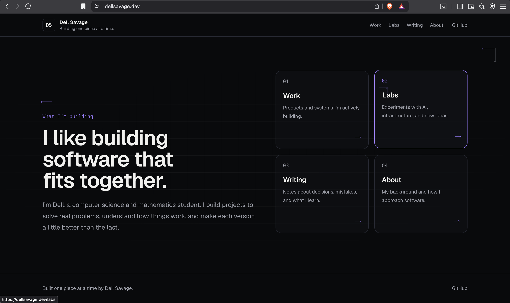

# DellSavage.dev

My personal software engineering portfolio, built to document the products,
infrastructure experiments, and technical notes I am developing.



## Live Site

[dellsavage.dev](https://dellsavage.dev)

## Overview

The site is designed as a simple public home for my work. It connects my main
projects, technical experiments, writing, and career direction in one place.

## Current Sections

- **Work** — public projects and product case studies
- **Labs** — infrastructure, local AI, and technical experiments
- **Writing** — technical notes and project decisions
- **About** — background, focus areas, and links

## Technology

- Next.js
- TypeScript
- React
- Tailwind CSS
- Netlify

## Running Locally

```bash
git clone https://github.com/dellsavage/dellsavage-dev.git
cd dellsavage-dev
npm install
npm run dev
```
